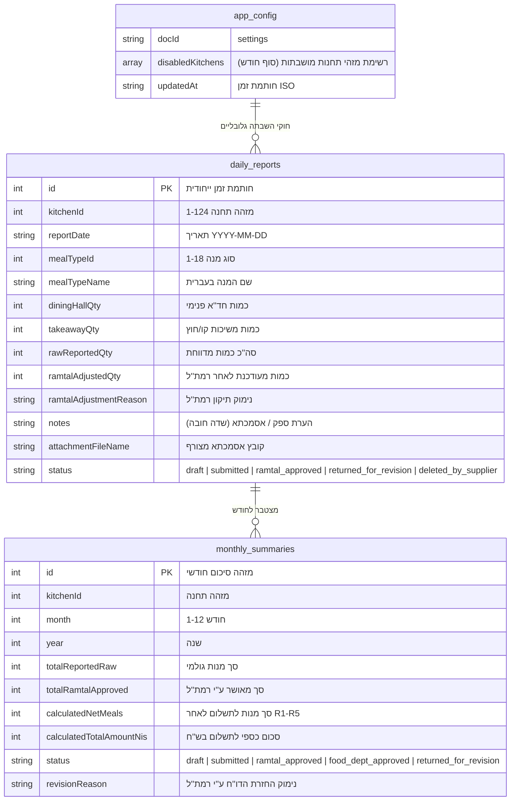
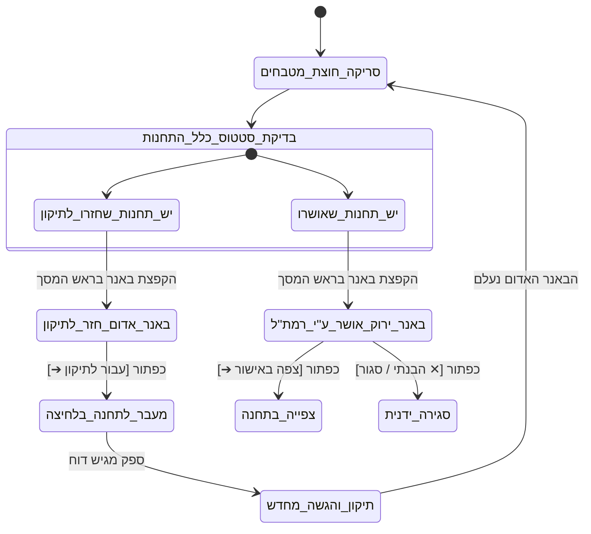

# מסמך אפיון מוצר וארכיטקטורה מבצעית (PRD)
## מערכת מיכון דיווח, בקרה ואישור ארוחות מחוץ לשעון
**משטרת ישראל • אגף התמיכה הלוגיסטית (את"ל) • מדור מזון וחוליית התייעלות כלכלית**  
*גרסת מערכת: Production V5.2 (Cloud Firestore Real-Time)*  
*תאריך עדכון אחרון: 02/09/2026*  
*סיווג: בלמ"ס (בלתי מסווג)*

---

## 📑 תוכן העניינים
1. [סקירת על ומטרת המוצר (Executive Summary)](#1-סקירת-על-ומטרת-המוצר-executive-summary)
2. [מיפוי משתמשים, ספקים והרשאות (Roles & Access Control)](#2-מיפוי-משתמשים-ספקים-והרשאות-roles--access-control)
3. [תשתית טכנולוגית ו-Tech Stack](#3-תשתית-טכנולוגית-ו-tech-stack)
4. [מודל נתונים וסנכרון ענן בזמן אמת (Firestore Data Architecture)](#4-מודל-נתונים-וסנכרון-ענן-בזמן-אמת-firestore-data-architecture)
5. [לוגיקה עסקית ומנוע חוקי חישוב R1–R5](#5-לוגיקה-עסקית-ומנוע-חוקי-חישוב-r1r5)
6. [ניהול מחזור חיי דיווח, טיוטות והשבתת מטבחים](#6-ניהול-מחזור-חיי-דיווח-טיוטות-והשבתת-מטבחים)
7. [מנוע התראות רוחבי חוצה-תחנות (Cross-Kitchen Live Alerts)](#7-מנוע-התראות-רוחבי-חוצה-תחנות-cross-kitchen-live-alerts)
8. [אבטחת מידע, הקשחה ו-DevSecOps](#8-אבטחת-מידע-הקשחה-ו-devsecops)
9. [סוכן הבדיקות, איכות ו-CI/CD (Quality Assurance)](#9-סוכן-הבדיקות-איכות-ו-cicd-quality-assurance)

---

## 1. סקירת על ומטרת המוצר (Executive Summary)

### 1.1 הרקע והצורך המבצעי
במשטרת ישראל מוגשות מדי חודש מאות אלפי ארוחות לשוטרים, לוחמים ומתנדבים ב-**124 תחנות, בסיסים ומתקנים** ברחבי הארץ באמצעות **4 ספקי הסעדה חיצוניים מורשים**.  
חלק ניכר מהארוחות נצרך "מחוץ לשעון" (פעילות מבצעית, כוחות מתגברים, משיכות חוץ, אירועים מיוחדים ושינוע).  
בעבר, תהליך הדיווח התבסס על טפסי נייר, קובצי אקסל מפוזרים וסנכרון ידני איטי שגרם לעיכובי תשלום, טעויות חישוב ואי-התאמות חשבונאיות מול הספקים.

### 1.2 יעדי המערכת
* **מיכון ואוטומציה מלאה מקצה לקצה:** מהזנת השורה היומית ע"י ספק ההסעדה, דרך אישור רמת"ל (רכז משק ותחזוקה לוגיסטית) משטרתי בשטח, ועד לבקרת מדור מזון והעברה לתשלום בגזברות/חשבות.
* **אכיפה הרמטית של חוקי המכרז והחישוב (R1–R5):** מניעת תשלום עודף באמצעות חישוב מדויק של קיצוצי מכשמש (10%), המרות גלאט/חולות/צוהר (30%), מנגנון השלמת מינימום רבעוני (R5) והמרת אירועים מיוחדים (R3).
* **סנכרון ענן בזמן אמת (Zero-Latency Real-Time Sync):** ביטול הצורך בריענון עמודים (F5) באמצעות דחיפת עדכונים חיה בין כל משתמשי הקצה.
* **עמידות ורציפות תפקודית (Offline-First Resilience):** שמירה מתמשכת של טיוטות בענן עם תמיכת מטמון מקומי בעת ניתוק רשת זמני.

---

## 2. מיפוי משתמשים, ספקים והרשאות (Roles & Access Control)

המערכת פועלת על פי מודל הרשאות מרוכז וקשיח (**Single Source of Truth** המוגדר ב-`src/utils/permissions.ts`):

```mermaid
flowchart LR
    A[ספק הסעדה מורשה] -->|הזנת דיווח + טיוטות| B(שלב 1: מסך דיווח ספק)
    B -->|הגשת דוח חודשי| C[רמת״ל משטרתי]
    C -->|אישור / תיקון שורות| D(שלב 2: אישור רמת״ל)
    D -->|אישור סופי| E[מדור מזון - את״ל]
    E -->|בקרת R1-R5 והפקת קבצים| F(שלב 3: אישור לתשלום)
    F --> G[גזברות / חשבות / אדמין]
```



### 2.1 מטריצת התפקידים ומשתמשי המערכת

| תפקיד במערכת | קוד משתמש ברירת מחדל | ספק / שיוך | היקף גישה ותחנות | מסכים מורשים |
| :--- | :--- | :--- | :--- | :--- |
| **ספק גורמה** | `David` / `sup-gourmet` | קייטרינג גורמה (1) | 3 תחנות בלבד | מסך 1 (דיווח ספק) |
| **ספק מבושלת** | `Ronit` / `sup-mevushelet` | מבושלת בע"מ (2) | 79 תחנות בלבד | מסך 1 (דיווח ספק) |
| **ספק ליבר** | `Yossi` / `sup-liber` | קייטרינג ליבר (3) | 40 תחנות בלבד | מסך 1 (דיווח ספק) |
| **ספק סודקסו** | `Ilan` / `sup-sodexo` | סודקסו ישראל (4) | 2 תחנות בלבד | מסך 1 (דיווח ספק) |
| **רמת"ל משטרתי** | `Avi` | משטרת ישראל | 124 תחנות לאישור שטח | מסך 2 (אישור רמת"ל) |
| **מדור מזון** | `Arik` | את"ל - מדור מזון | כלל ארצי (124 תחנות) | מסכים 2, 3, 4 (רמת"ל, מדור מזון, הצלבת שעון) |
| **גזברות / חשבות** | `Dana` | חשבות משטרת ישראל | צפייה בלבד (Read-Only) | מסכים 3, 4 (צפייה ללא עריכה) |
| **מנהל מערכת (Admin)** | `zeev` | מנהל על (את"ל) | גישה מלאה לכלל 124 התחנות | כל 5 המסכים (כולל פאנל אדמין ואיפוסים) |

---

## 3. תשתית טכנולוגית ו-Tech Stack

המערכת פועלת בארכיטקטורת **Serverless Jamstack** בענן Google Cloud Platform / Firebase:

* **שכבת ה-Frontend:**
  * **React 18 + TypeScript:** פיתוח מונחה טיפוסים קפדני.
  * **Vite 6:** כלי הידור ובנייה מודרני בעל ביצועים גבוהים.
  * **Tailwind CSS:** עיצוב מודרני מותאם מלא לעברית (RTL) ומותאם לתקני נגישות ומובייל.
  * **Lucide React:** ספריית אייקונים ייעודית לחיווי סטטוסים וכפתורי פעולה.
* **שכבת האחסון וה-CDN (Hosting):**
  * **Firebase Hosting (Global Edge CDN):** פריסת אפליקציית SPA תחת הכתובת `https://meal-reporting-app.web.app`.
  * **כותרות אבטחה מחמירות:** HSTS, CSP, X-Frame-Options DENY, X-Content-Type-Options nosniff.
* **שכבת הנתונים (Database):**
  * **Google Cloud Firestore (NoSQL Document Database):**
  * **Region:** מופעל פיזית בישראל (**`me-west1` — תל אביב**) לעמידה בתקני ריבונות מידע וזמני שהייה אפסיים.
  * **עמידות אופליין:** מנגנון `persistentLocalCache` ו-`persistentMultipleTabManager` מבוסס IndexedDB בדפדפן.

---

## 4. מודל נתונים וסנכרון ענן בזמן אמת (Firestore Data Architecture)

מסד הנתונים בענן מאורגן ב-3 אוספים ראשיים (**Collections**):



### 4.1 מנגנוני סנכרון ושמירת טיוטות (Live Auto-Save & Clean Data)
1. **טיהור שדות ענן (`cleanFirestoreData`):**  
   פונקציית תשתית המסירה ערכי `undefined` לפני כל פעולת `setDoc` / `updateDoc`, ובכך מונעת קריסות של ה-SDK של Firestore.
2. **שמירה אוטומטית מתמשכת של טיוטות (Continuous Auto-Save):**  
   כל שינוי שדה בשורת טיוטה במסך הספק (תאריך, סוג מנה, כמויות, הערות) נדחף מיידית ל-Firestore באמצעות `updateDoc` ומציג חיווי חי: `💾 נשמר בענן ✓`.
3. **עמידות ברענון עמוד (F5 Resilience):**  
   מאזיני ה-`onSnapshot` טוענים את הטיוטות בדיוק במצב שבו הופסקו.
4. **בידוד הרמטי של טיוטות (Draft Isolation):**  
   שורות וסיכומים בסטטוס `draft` אינם נחשפים לרמת"ל במסך 2 ואינם נכנסים לחישובי מדור מזון במסך 3 עד להגשתם הרשמית ע"י הספק (`submitted`).

---

## 5. לוגיקה עסקית ומנוע חוקי חישוב R1–R5

המערכת כוללת מנוע חישוב מרכזי (`MealCalculationEngine`) המיישם את תקנות משרד המשטרה והמכרז:

```
[דיווח גולמי: חד"א + משיכות]
         │
         ▼
[בקרת רמת"ל בשטח: אישור / התאמת כמויות פר שורה]
         │
         ▼
┌─────────────────────────────────────────────────────────────┐
│                 מנוע המרות ובקרה R1–R5                       │
├─────────────────────────────────────────────────────────────┤
│ • R1 (מכשמש): קיצוץ 10% מכמות חד"א בלבד בתחנות מוגדרות      │
│ • R2 (גלאט/צוהר/חולות): תוספת 30% מנות עבור שדרוג כשרות      │
│ • R3 (אירועים מיוחדים): המרת חשבונית (ש"ח) למנות שוות-ערך   │
│ • R4 (תעריפי אשכול): הכפלה בתעריף החוזי לפי אשכול התחנה     │
│ • R5 (מינימום רבעוני): השלמת גירעון מנות בחודש סוגר רבעון   │
└─────────────────────────────────────────────────────────────┘
         │
         ▼
[סך מנות לתשלום + אומדן כספי סופי בש"ח למדור מזון ולגזברות]
```

### 5.1 פירוט חוקי החישוב
* **חוק R1 — מנגנון קיצוץ מכשמש (10%):**  
  חל אך ורק על מנות שנאכלו בחדר האוכל הפנימי (`diningHallQty`) בתחנות שהוגדרו במכרז עם דגל `appliesR1Machmesh = true`. משיכות חוץ/קו (`takeawayQty`) אינן מקוצצות.  
  $$\text{R1\_Meals} = \lfloor \text{DiningHall} \times 0.9 \rfloor + \text{Takeaway}$$
* **חוק R2 — תוספת כשרות מהודרת / גלאט (30%):**  
  בתחנות ייעודיות (כדוגמת מתקני כליאה, צוהר וחולות), מתווספת תוספת של 30% למנות הבסיס לצורך כיסוי עלויות הכשרות המהודרת.  
  $$\text{R2\_Meals} = \text{ApprovedMeals} \times 1.3$$
* **חוק R3 — המרת חשבוניות אירועים מיוחדים ואירוח:**  
  חשבוניות אירוח ואירועים חריגים מומרות למספר מנות שוות-ערך לפי תעריף המנה הבסיסי של אותה תחנה.
* **חוק R5 — השלמת התחייבות מינימום רבעוני:**  
  בחודשים סוגרי רבעון (מרץ, יוני, ספטמבר, דצמבר), נבדקת עמידת התחנה ברף המינימום הרבעוני (למשל 2,400 מנות לרבעון). במידה וקיים גירעון, המערכת מוסיפה אוטומטית שורת השלמה לתשלום.

---

## 6. ניהול מחזור חיי דיווח, טיוטות והשבתת מטבחים

### 6.1 אוטונומיה מלאה ברמת השורה הבודדת (Row-Level Autonomy)
* **אישור ברמת השורה:** הרמת"ל רשאי לאשר שורות תקינות, לעדכן כמות לשורה מסוימת עם נימוק חובה, או להחזיר שורה בודדת לתיקון.
* **אי-חסימת שורות תקינות (No-Bleed Workflow):** החזרת שורה מסוימת לתיקון אינה פוגעת בשורות שאושרו, ומאפשרת לספק לתקן אך ורק את השורות הדחויות.
* **תיעוד מחיקת שורות שהוחזרו (Audit Trail):** שורה שהוחזרה לתיקון והספק החליט למחוק אותה, אינה נמחקת מהמסד אלא עוברת לסטטוס `deleted_by_supplier` ומוצגת לרמת"ל בעיצוב אפור כתיעוד היסטורי נעול.

### 6.2 מנגנון השבתת מטבחים בסוף חודש (Kitchen Lockout Mechanism)
* מנהל המערכת (Admin) יכול להשבית מטבח באופן זמני (למשל עם סגירת החודש לתשלום).
* **אכיפה הרמטית במסך הספק:**
  * חסימת הוספת שורות חדשות (`disabled`).
  * חסימת עריכה ושכפול שורות קיימות.
  * חסימת כפתור הגשת הדו"ח החודשי.
  * הצגת באנר אזהרה בולט בצבע בורדו-אדום: `⛔ תחנה זו הושבתה ע"י מנהל המערכת (סוף חודש)`.

### 6.3 שלושת היקפי האיפוס והמחיקה למנהל מערכת (Admin Scopes)
פאנל האדמין מאפשר פעולות איפוס מבוקרות ב-3 היקפים מוגדרים:
1. **תחנה נוכחית (Current Kitchen):** מחיקת טיוטות או איפוס דיווחים למטבח הנבחר בלבד.
2. **ספק מורשה (Current Supplier):** איפוס רוחבי לכל התחנות המשויכות לספק מסוים.
3. **כלל 124 המטבחים (All Kitchens - Master Reset):** איפוס מערכתי כולל (הדורש הקלדת מחרוזת אימות קשיחה `איפוס מלא`).

---

## 7. מנוע התראות רוחבי חוצה-תחנות (Cross-Kitchen Live Alerts)

במסך הספק פועל מנגנון סריקה חוצת-תחנות הסורק בזמן אמת את כל 124 המטבחים המשויכים לספק המחובר:



### 7.1 באנר אדום/כתום — דיווחים שחזרו לתיקון מהרמת"ל
* **תנאי הפעלה:** מופיע כאשר קיימת תחנה אחת או יותר של הספק בסטטוס `returned_for_revision` או שיש בה שורות דחויות.
* **נוסח הבאנר:**  
  `⚠️ שים לב: התקבלו דיווחים שחזרו לתיקון מהרמת"ל בתחנות הבאות: [רשימת תחנות]`
* **כפתור פעולה:** `[עבור לתיקון ➔]` — מעביר מידית את הדרופדאון והטבלה לתחנה הדורשת טיפול.
* **לוגיקת העלמה קשיחה:** הבאנר נעלם **אך ורק** לאחר שהספק השלים את התיקונים והגיש מחדש את הדוח לרמת"ל (`submitted`).

### 7.2 באנר ירוק — דיווחים שאושרו ע"י הרמת"ל
* **תנאי הפעלה:** מופיע כאשר קיימת תחנה אחת או יותר שהדוח החודשי שלה אושר ע"י הרמת"ל (`ramtal_approved`).
* **נוסח הבאנר:**  
  `✅ עדכון: הדיווח החודשי אושר בהצלחה ע"י הרמת"ל בתחנות הבאות: [רשימת תחנות]`
* **כפתור פעולה:** `[צפה באישור ➔]` — ניווט מהיר לתחנה המאושרת.
* **לוגיקת העלמה:** כפתור `[✕ הבנתי / סגור]` המעלים את ההתראה ברמת הסשן המקומי (`sessionStorage`).

---

## 8. אבטחת מידע, הקשחה ו-DevSecOps

המערכת עברה מבדק אבטחה וארכיטקטורה מלא (**Full Security & Architecture Audit**):

### 8.1 אבטחת חוקי ה-Firestore (`firestore.rules`)
* **Default-Deny:** חסימת כל גישה בלתי מורשת כברירת מחדל (`match /{document=**} { allow read, write: if false; }`).
* **אימות סכמה (Schema Validation):** חובת שדות מוגדרים (`kitchenId`, `reportDate`, `mealTypeId`, `rawReportedQty`) ובדיקת טיפוסים מספריים לפני אישור כתיבה.

### 8.2 כותרות אבטחה ב-Hosting (`firebase.json`)
* **Strict-Transport-Security (HSTS):** אכיפת HTTPS למשך שנה (`max-age=31536000; includeSubDomains`).
* **Content-Security-Policy (CSP):** הגבלה קשיחה של מקורות טעינת סקריפטים, עיצובים ופונטים מאושרים בלבד.
* **X-Frame-Options: DENY:** חסימה מוחלטת של מתקפות Clickjacking.
* **X-Content-Type-Options: nosniff:** חסימת מתקפות MIME-sniffing.
* **Referrer-Policy: strict-origin-when-cross-origin.**

### 8.3 חיטוי קלטים ומניעת XSS (`src/utils/sanitize.ts`)
* פונקציות `sanitizeText`, `sanitizeDailyReportInput` ו-`sanitizeReason` מטהרות כל קלט טקסטואלי (הערות ספק, נימוקי רמת"ל, שמות קבצים) מתגיות HTML, תסריטי JS, ו-Event Handlers לפני שמירתם בענן.

### 8.4 ניהול מפתחות ומשתני סביבה (Secrets Hygiene)
* קובץ `.gitignore` מחמיר החוסם העלאת קובצי `.env`, `.env.local`, `*.pem`, `firebase_login.json` וקובצי לוג מקומיים.
* קונפיגורציית ה-Firebase נטענת דינמית מ-`import.meta.env.VITE_FIREBASE_*`.

---

## 9. סוכן הבדיקות, איכות ו-CI/CD (Quality Assurance)

המערכת מגובה בסוויטת בדיקות אוטומטית מלאה (`src/engine/__tests__/workflow.test.js`) הכוללת **19 בדיקות קצה-לקצה (100% PASS)**:

```
TAP version 13
# Subtest 1:  R1 Machmesh 10% Cut Logic
# Subtest 2:  R2 Tzohar / Glatt 30% Addition Logic
# Subtest 3:  R3 Special Events & Hospitality Invoices Conversion
# Subtest 4:  R5 Quarterly Minimum Deficit Reconciliation
# Subtest 5:  Strict Row Autonomy & No-Bleed Workflow (V4)
# Subtest 6:  Audit Trail for Supplier-Deleted Rejected Rows (V5)
# Subtest 7:  Admin Reset & Delete Scope Options (3 Scopes)
# Subtest 8:  Station to Supplier Mapping Distribution (124 Stations)
# Subtest 9:  Uniform Clean Empty State for All 124 Kitchens
# Subtest 10: Dynamic Period Tag in Header (MM/YYYY)
# Subtest 11: Kitchen Disabling Mechanism (Lockout & Persistence)
# Subtest 12: Firebase Firestore Cloud Migration (Collections & Rules)
# Subtest 13: Security Audit: No Hardcoded Secrets in Source Code
# Subtest 14: Security Audit: Firestore Rules Default-Deny & Schema
# Subtest 15: Security Audit: Firebase Hosting Security Headers
# Subtest 16: Security Audit: Centralized Permissions Module (SSOT)
# Subtest 17: Security Audit: Input Sanitization (XSS Prevention)
# Subtest 18: Cloud Draft Persistence, Auto-Save & Refresh Resilience
# Subtest 19: Cross-Kitchen Status Audit & Live Supplier Banners
1..19
# tests 19 | pass 19 | fail 0 (100% SUCCESS)
```

### 9.1 צנרת הפריסה (Deployment Pipeline)
1. הרצת סוכן הבדיקות המלא: `npm test` (19/19 ירוק).
2. הידור ובניית צרור פרודקשן: `npm run build` (אימות TypeScript ו-Vite).
3. פריסה מאוחדת לענן: `npx firebase-tools deploy` (Hosting + Firestore Rules).
4. גיבוי קוד מלא: סנכרון ל-GitHub (`tichnunatal-commits/meal-reporting-automation`).

---
**משטרת ישראל • אגף התמיכה הלוגיסטית (את"ל) • מדור מזון וחוליית התייעלות כלכלית © 2026**
