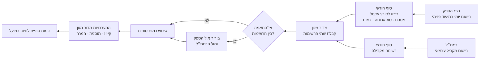
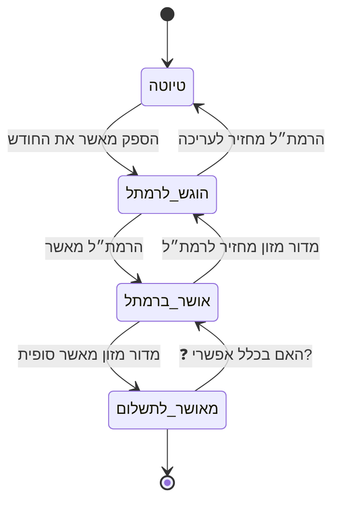

# 1–4. רקע, מונחים, שחקנים והמצב הקיים

> סימון מקורות: 📄 מכתב האפיון · 💬 שיחה עם ישי · 💡 הצעה שלי (לא אושרה) · ❓ לא ידוע · ⚠️ סתירה/סיכון
> **הפרק הזה הוא הבסיס. אם משהו בו לא נכון — כל האפיון שיישען עליו יהיה שגוי. זה הפרק שחייב אישור מפורש של אריק.**

---

## 1. רקע ומטרה

### 1.1 הרקע העסקי

משטרת ישראל משלמת לספקי ההסעדה על ארוחות בשני ערוצים עיקריים 📄:

| # | ערוץ | כיצד נרשם | האם בתחולת הפרויקט |
|---|---|---|---|
| 1 | **ארוחות בשעון** | העברת כרטיס בשעון הנוכחות 📄 | **לא** — מחוץ לתחולה |
| 2 | **ארוחות מחוץ לשעון** | באישור מדור מזון ובהסדר מול הספקים 📄 | **כן** — זה הפרויקט |

בפגישת סטאטוס כלכלה אצל ראש את"ל סוכם שמדור התייעלות ימכן, יחד עם מדור מזון, את תהליך הדיווח והריכוז של כמויות הארוחות מחוץ לשעון 📄.

### 1.2 המטרה

מיכון כל התהליך במערכת **WEB חיצונית** שתשמש את הספקים ואת הפונקציות הרלוונטיות במשטרה 📄.

### 1.3 סיווג

**הפרויקט והנתונים ברמת בלמ"ס בלבד** 📄.

### 1.4 הערכת זמנים שנמסרה

כחודש מימוש 📄.
⚠️ ההערכה הזו מתייחסת ככל הנראה לפיתוח בלבד. היא איננה כוללת אישורי אבטחת מידע להקמת מערכת חיצונית שספקים חיצוניים נכנסים אליה, הקמת סביבת אירוח, ואיסוף נתוני הבסיס (מטבחים, מחירים, חוזים). ראו `04-open-questions.md`, קבוצה 6.

---

## 2. תחולה

### 2.1 בתוך התחולה

- דיווח שוטף של כמויות ארוחות **מחוץ לשעון** על ידי הספקים 📄
- צירוף אסמכתאות לדיווח 📄
- אישור/עדכון הכמויות על ידי רמת"ל 📄
- טיפול אוטומטי בסוגיות ההתערבות של מדור מזון (סעיף 4.4) 📄
- אישור סופי של הכמות החודשית לתשלום 📄
- מערך הרשאות ואותנטיקציית התחברות 📄
- ניהול טבלת מטבחים, סוגי ארוחה ותעריפים 📄

### 2.2 מחוץ לתחולה

- ארוחות שנרשמו **בשעון** (העברת כרטיס) 📄
- ⚠️ ביצוע התשלום בפועל — המערכת מייצרת אישור/כמות, אך **❓ לא ידוע לאן הפלט הולך** ומי משלם בפועל. ראו Q-27.

### 2.3 היקף מספרי

| פריט | כמות | מקור |
|---|---|---|
| ספקים | ~3 | 💬 |
| משתמשי ספק | ~20 לכל ספק (סה"כ ~60) | 💬 |
| רמת"לים (מהמשטרה) | ~30 | 💬 |
| משתמשי מדור מזון | ~5 | 💬 |
| **סה"כ משתמשים** | **~95** | חישוב |
| מטבחים | ❓ לא ידוע | Q-28 |
| סוגי ארוחה | ❓ לא ידוע | Q-29 |

---

## 3. מילון מונחים

| מונח | פירוש | מקור |
|---|---|---|
| **ארוחה מחוץ לשעון** | ארוחה שסופקה בפועל אך לא נרשמה בהעברת כרטיס בשעון; משולמת באישור מדור מזון ובהסדר מול הספק | 📄 |
| **מדור מזון** | הגורם המקצועי במשטרה שמאשר סופית את הכמויות לתשלום ומבצע את ההתערבויות | 📄 |
| **מדור התייעלות** | מדור התייעלות כלכלית — היוזם והמבצע של הפרויקט | 📄 |
| **רמת"ל** | תפקיד **במשטרה**. מקבל את הסיכום החודשי מנציג הספק, ומאשר / מתקן / מחזיר לעריכה. ❓ ראשי התיבות טרם הוגדרו | 💬 |
| **נציג ספק** | תפקיד **מטעם הספק**. האדם שרושם, מרכז את הכמויות ומגיש אותן לאישור הרמת"ל. במכתב הוא מכונה «נציג הספק» — אותו אדם | 💬 |
| **מטבח** | מקום אספקת הארוחה. יחידת הדיווח הבסיסית | 📄 |
| **חד"א** | חדר אוכל | 📄 (בהקשר מכמש) |
| **משיכות החוצה** | ארוחות שנלקחו מהמטבח ולא נאכלו בחדר האוכל הפנימי | 📄 |
| **אסמכתא** | קובץ תומך שמועלה למערכת ומצורף לדיווח (סריקה, תמונה, PDF וכד') 💬. ❓ נותר לברר: חובה תמיד או רק באירועים, וברמת יום או חודש — ראו Q-24 | 💬 |
| **תעריף / מחיר מנה** | מחיר ארוחה, שהוא נגזרת של מטבח × סוג ארוחה | 📄 |
| **המרה** | שינוי הכמות המדווחת לפי כלל מוסכם (קיזוז, תוספת, או המרת סכום לכמות) | 📄 |
| **השלמה רבעונית** | תוספת כמות במטבחים שבהם קיימת חובת מינימום חוזית | 📄 |
| **בלמ"ס** | בלתי מסווג — רמת הסיווג של הפרויקט | 📄 |
| **את"ל** | אגף התכנון והלוגיסטיקה (ההקשר שבו התקבלה ההחלטה) | 📄 |

> ### ℹ️ הבהרה טרמינולוגית — שלושה מונחים
>
> במכתב מופיע: **«מפקח הסעדה/רמת"ל (המשטרה)»** 📄 — שני שמות לאותו תפקיד משטרתי. במקום אחר המכתב קורא לאיש הספק **«נציג הספק»** 📄.
>
> 💬 **שלושת המונחים:**
> | המונח | מי הוא | מה הוא עושה |
> |---|---|---|
> | **רמת"ל** | **המשטרה** | מאשר / מתקן / מחזיר לעריכה |
> | **מפקח הסעדה** | **המשטרה** | שם נוסף לרמת"ל — אותו אדם |
> | **נציג ספק** | **הספק** | רושם, מרכז, מגיש לאישור |
>
> **רמת"ל = מפקח הסעדה** — שני שמות לאותו תפקיד משטרתי.
> **נציג ספק** — המונח הנכון לאיש הספק, כפי שמופיע במכתב.

---

## 4. המצב הקיים

### 4.1 תיאור מילולי

היום **כל התהליך מתנהל בקבצי אקסל** 📄.

נציג הספק רושם בתיעוד פנימי את כמות הארוחות שסופקו בכל יום. בסוף החודש הוא מרכז את הכמויות לקובץ אקסל הכולל פילוח לפי **סוג הארוחה**, **מקום הארוחה (מטבח)** ו**כמות** 📄.

במקביל, הרמת"ל מנהל **רשימה מקבילה ועצמאית** עם תיעוד פנימי, בדומה לספק 📄.

שתי הרשימות נשלחות למדור מזון. במידה ויש אי־התאמה בין הכמויות, מדור מזון עורך את הבירור הרלוונטי ומגבש את הכמות הסופית לחיוב בפועל 📄.

> ✅ **הוכרע (ישי, 06/08/2026):** במערכת החדשה **הרמת"ל אינו יוצר רשימה משלו.** הוא עובר על הסיכום החודשי של הספק ומאשר, מתקן, או מחזיר לעריכה 💬.
>
> ⚠️ **המשמעות, כדי שתהיה רשומה במפורש ולא תתגלה בדיעבד:** במצב הקיים שני אנשים סופרים בנפרד, וההצלבה בין שתי הרשימות היא מנגנון הבקרה 📄. במערכת החדשה **הבקרה הכפולה הזו לא קיימת** — הרמת"ל רואה קודם את המספר של הספק ומאשר אותו. זו **החלטה מודעת**, לא השמטה. ראו צומת הכרעה 1 בקובץ `02-decision-forks.md`.

### 4.2 תרשים המצב הקיים

### 4.3 טבלת שלבים

| # | שלב | מי מבצע | כלי | תדירות | מקור |
|---|---|---|---|---|---|
| 1 | רישום יומי של כמות שסופקה | נציג הספק | תיעוד פנימי | יומי | 📄 |
| 2 | רישום מקביל עצמאי | רמת"ל | תיעוד פנימי | ❓ לא צוין | 📄 |
| 3 | ריכוז לאקסל בפילוח מטבח/סוג/כמות | נציג הספק | אקסל | סוף חודש | 📄 |
| 4 | ריכוז הרשימה המקבילה | רמת"ל | אקסל | סוף חודש | 📄 |
| 5 | שליחת שתי הרשימות | שניהם | ❓ מייל? | סוף חודש | 📄 |
| 6 | בירור אי־התאמות | מדור מזון | ❓ טלפון/מייל | לפי הצורך | 📄 |
| 7 | הפעלת ההתערבויות (סעיף 4.4) | מדור מזון | אקסל ידני | חודשי + רבעוני | 📄 |
| 8 | גיבוש כמות סופית לחיוב | מדור מזון | אקסל | חודשי | 📄 |
| 9 | העברה לתשלום | ❓ לא ידוע | ❓ | ❓ | — |

### 4.4 חמש סוגיות ההתערבות של מדור מזון

אלה החוקים העסקיים היחידים שתועדו במפורש. **כולם מנוסחים במכתב במשפט אחד בלבד, וכולם דורשים השלמה.** 📄

| # | מטבח / מקרה | הכלל כפי שנכתב | מה חסר כדי לממש |
|---|---|---|---|
| **R1** | **מכמש** | ככל שהכמות מתייחסת להסעדה **בחד"א הפנימי** (לא משיכות החוצה) — **קיצוץ של 10%** מהכמות הסופית | ⚠️ הכלל דורש **פיצול הכמות** לשניים: חד"א פנימי מול משיכות החוצה. ❓ **לא ידוע אם הספק רושם את הפיצול הזה היום.** אם לא — זו דרישת דיווח חדשה, לא מיכון של הקיים. ראו Q-17 |
| **R2** | **צוחר / חולות** | **תוספת של 30%** לכמות הסופית (המרה לשווי ארוחה בכשרות מהודרת) | ❓ האם 30% על הכמות או על המחיר? המכתב אומר כמות. ❓ כללי עיגול — 47 × 1.3 = 61.1, זה 61 או 62? ראו Q-18, Q-19 |
| **R3** | **אירועים / כיבודים** | המרה של **הסכום** לתשלום הסופי **לכמויות ארוחות** מהספק | ❓ מהו הקלט — סכום בשקלים מהצעת מחיר? חשבונית? מי מזין? באיזה מחיר מחלקים? ראו Q-20 |
| **R4** | **מתקנים עם ארוחות ערב חמות** | המרת **פער המחירים** בין מחיר ארוחת ערב למחיר ארוחת צהריים — לכמות | ❓ דורש שני מחירים לאותו מטבח. ❓ מהי "ארוחת הייחוס"? ראו Q-21 |
| **R5** | **השלמות רבעוניות** | במטבחים שבהם יש **חובת מינימום** — השלמת כמויות | ⚠️ **זהו כלל רבעוני בתוך מחזור חודשי.** ❓ מי מאשר? באיזה חודש הוא נכנס לחיוב? מה קורה אם מטבח נסגר באמצע רבעון? ראו Q-22 |

**❓ שאלה שחלה על כל החמישה: מה סדר הפעולות?** מטבח שחלים עליו גם R2 וגם R5 — האם ההשלמה מחושבת לפני התוספת או אחריה? התוצאה שונה, וזה כסף. ראו Q-23.

### 4.5 הכאבים במצב הקיים

| # | כאב | מקור |
|---|---|---|
| P1 | **קבצי האקסל מהספקים אינם אחידים** ומנוהלים ידנית | 📄 (נאמר במפורש) |
| P2 | אין מקור אמת אחד — שלוש גרסאות של אותו נתון (ספק, רמת"ל, מדור מזון) | נגזר מ־📄 |
| P3 | הבירור על אי־התאמות נעשה **בדיבור**, ולא מתועד | 💬 |
| P4 | ההתערבויות (R1–R5) מחושבות ידנית — חשופות לטעות אנוש | נגזר מ־📄 |
| P5 | אין תיעוד של מי אישר מה ומתי | נגזר — ❓ טעון אימות |
| P6 | ❓ אין ידיעה האם מישהו מצליב מול נתוני השעון — **פוטנציאל לתשלום כפול על אותה ארוחה**. ראו Q-26 | ⚠️ |

---

## 5. שחקנים ומשתמשים

> ⚠️ הפרק הזה חלקי. חלוקת התפקידים בתוך כל קבוצה טרם הובהרה — ראו צומת הכרעה 5.

| # | שחקן | כמה | מה עושה היום | מכשיר | מקור |
|---|---|---|---|---|---|
| U1 | **נציג ספק** (מטעם הספק) | ~20 לכל ספק, 3 ספקים | רושם יומי, מרכז חודשי, מגיש לאישור | ❓ סביר שטלפון במטבח + מחשב במשרד | 📄 💬 |
| U2 | **רמת"ל** (מהמשטרה) | ~30 | מקבל את הסיכום החודשי, מאשר / מתקן / מחזיר לעריכה. **אינו רושם רשימה משלו** | ❓ | 💬 |
| U3 | **מדור מזון** | ~5 | מברר אי־התאמות, מפעיל את R1–R5, מאשר סופית | ❓ מחשב | 📄 💬 |
| U4 | **מנהל מערכת** | ❓ כמה? | **קיים** 💬. מקים משתמשים, מוסיף מטבחים, מעדכן מחירים. ❓ מי ממלא את התפקיד ובאיזה גוף | — | 💬 + Q-14 |
| U5 | **צופה בלבד** (את"ל / כספים / הנהלה) | ❓ **לא הוגדר** | ❓ האם מישהו צריך לראות דוחות בלי לערוך? | — | ⚠️ Q-16 |

### 5.1 מה כבר ידוע על ההרשאות

- כל ~20 משתמשי הספק **רואים את כל המטבחים של אותו ספק ועורכים אותם** 💬.
  ⚠️ **משמעות:** אין הפרדה בין מזין למגיש. כל אחד מ־20 יכול, ככל הנראה, לאשר את החודש. ראו צומת הכרעה 5.
- לרמת"לים יש "ההרשאות שלהם" 💬 — ❓ לא הוגדר מהן, ומהו היקף המטבחים של כל רמת"ל.
- טבלת המשתמשים שהוצעה מכילה: **מייל חיצוני, שם משתמש, רמת הרשאה** 📄.
  ⚠️ "מייל חיצוני" מתאים לספקים. ❓ לא ברור איך מתחברים ~35 משתמשי המשטרה. ראו Q-31.

---

## 6. תיאור התהליך במערכת החדשה — כפי שנכתב במכתב

זהו ציטוט מסודר של מה שהמכתב מגדיר, **ללא תוספות שלי**. 📄

| שלב | תוכן |
|---|---|
| **א'** | רישום כמויות באופן שוטף על ידי הספק, כולל צירוף אסמכתאות |
| ↓ | **אישור הכמות החודשית** (על ידי הספק) |
| **ב'** | אישור / עדכון הכמויות על ידי הרמת"ל |
| **ג'** | תמיכה אוטומטית בסוגיות שבהן יש התערבות של מדור מזון (R1–R5) |
| ↓ | **אישור הכמות החודשית לתשלום** |

**הערה מהמכתב:** בכל שלב ניתן להחזיר לעריכת הנתונים **רמה אחת אחורה**. לדוגמה — לאחר אישור הכמות החודשית על ידי הספק, הכמויות נעולות לעריכה, והרמת"ל יכול להחזיר את השדות לעריכה באופן יזום לספק 📄.

### 6.1 מכונת המצבים הנגזרת

💡 זהו **פירוש שלי** של המשפטים לעיל למצבים מוגדרים. טרם אושר.

**❓ שאלות פתוחות על מכונת המצבים:**
- כשמדור מזון מחזיר לרמת"ל — האם גם אישור הספק נפתח, או רק אישור הרמת"ל? (EC-06)
- האם אפשר לפתוח חודש שכבר אושר לתשלום? (EC-03)
- מתי בדיוק מופעלים חוקי R1–R5 — בכניסה לשלב ג' או ביציאה ממנו? האם הרמת"ל רואה את הכמות לפני או אחרי ההמרה? ⚠️ **זו שאלה חשובה — ראו Q-25.**

---

## 7. מה שאלתי את עצמי ולא מצאתי עליו תשובה בשום מקום

1. מה קורה **בין** שלב א' לשלב ב' — האם יש התראה לרמת"ל שהחודש מחכה לו? (Q-08)
2. מהו תאריך היעד להגשה, ומה קורה כשהוא עובר? (Q-02)
3. האם מטבח בלי ארוחות מחוץ לשעון בכלל מופיע בחודש? (EC-04)
4. מהו הפלט הסופי של המערכת — קובץ? דוח חתום? ממשק למערכת כספים? (Q-27)
5. איפה נשמר התיעוד של הבירור בטלפון בין הרמת"ל לספק? (EC-15)
