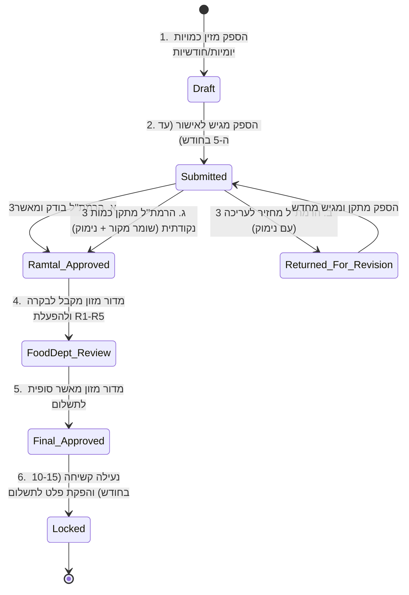
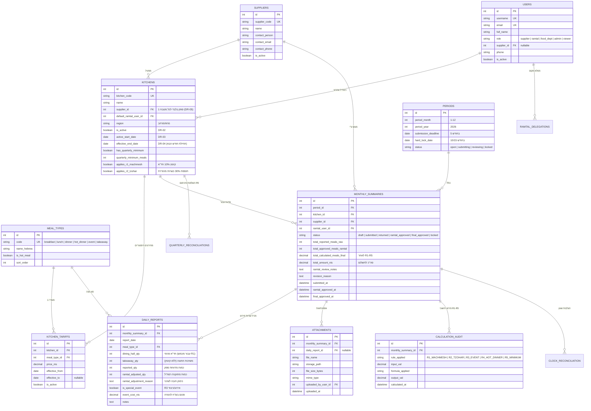

# אפיון ארכיטקטורה ומודל נתונים (Data Model & System Architecture)
## פרויקט מיכון דיווח כמויות ארוחות מחוץ לשעון — מדור מזון

| | |
|---|---|
| **סטטוס** | מסמך תכנון וארכיטקטורה מלא (Draft v1.0) |
| **תאריך** | 17/08/2026 |
| **סיווג** | **בלמ"ס** |
| **מחברים** | ישי + אור (חוליית התייעלות כלכלית) בשיתוף אריק (מדור מזון) ורפ"ק זאב נאורי |

---

## 1. ארכיטקטורת המערכת (System Architecture)

### 1.1 עקרונות הארכיטקטורה
1. **הפרדת רשתות ואבטחה (בלמ"ס):** המערכת מתוכננת לארח ממשק Web מאובטח (HTTPS) המאפשר כניסת ספקים חיצוניים מהאינטרנט עם אימות מאובטח, לצד חיבור שוטרים (רמת"לים, מדור מזון, מנהלי מערכת).
2. **שלמות נתונים והיסטוריוגרפיה (Auditability):** 
   - **אין מחיקה פיזית (Hard Delete)** של מטבחים, ספקים, מחירים או דיווחים (DR-02).
   - כל תיקון כמות של רמת"ל או מדור מזון שומר את הנתון המקורי של הספק ודורש שדה נימוק חובה.
   - מחירים וכללי חישוב מנוהלים עם תוקף תאריכי (Effective Dates) כדי ששינויי חוזים עתידיים לא יעוותו חודשי עבר סגורים.
3. **צנרת חישוב שקופה (Calculation Pipeline R1–R5):** הרמת"ל מאשר כמויות פיזיות; כללי ההמרה, הקיזוזים וההשלמות הרבעוניות מחושבים אוטומטית בצורה שקופה ומתועדת.

### 1.2 תרשים ארכיטקטורה ורכיבים

```mermaid
graph TD
    subgraph "Clients (Frontend - RTL React / Tailwind)"
        A[נציג ספק הסעדה<br/>(מובייל / דסקטופ)]
        B[רמת''ל / מפקח הסעדה<br/>(משטרתי / נייד)]
        C[מדור מזון ומנהל מערכת<br/>(דשבורד בקרה ואישורים)]
        D[צופים: גזברות / את''ל<br/>(דוחות ופלט לתשלום)]
    end

    subgraph "Application Layer (Node.js / Express / TypeScript)"
        API[API Gateway & Auth Service<br/>RBAC + JWT / Sessions]
        WF[Workflow & Validation Engine<br/>מחזור חודשי, נעילות, תאריכי יעד]
        CalcEngine[R1-R5 Calculation Engine<br/>מכמש, צוחר, אירועים, ערב, מינימום]
        AuditSvc[Audit & History Tracker<br/>רישום כל שינוי ופעולה]
        ClockSync[Clock Reconciliation<br/>הצלבה מול שעון נוכחות]
        ExportSvc[Reporting & Export<br/>Excel / PDF חתום לתשלום]
    end

    subgraph "Data & Storage Layer"
        DB[(PostgreSQL / SQLite<br/>Relational Database)]
        Storage[(Secure File Storage<br/>אסמכתאות וקבלות PDF/JPG)]
    end

    A -->|HTTPS / הזנת כמויות ואסמכתאות| API
    B -->|אישור / תיקון מנומק / החזרה| API
    C -->|בקרת עלויות, הרשאות, מחירונים| API
    D -->|הפקת דוחות וייצוא כספי| API

    API --> WF
    API --> CalcEngine
    API --> AuditSvc
    API --> ClockSync
    API --> ExportSvc

    WF --> DB
    CalcEngine --> DB
    AuditSvc --> DB
    ClockSync --> DB
    ExportSvc --> Storage
```

---

## 2. תהליך העבודה ומכונת המצבים (Workflow & State Machine)



---

## 3. מודל הנתונים המלא (Entity Relationship Diagram - ERD)



---

## 4. פירוט מנוע חוקי החישוב (R1–R5 Calculation Engine)

| קוד חוק | שם הכלל | יישום במודל ובנוסחה | סדר ביצוע |
|---|---|---|:-:|
| **R1** | **קיצוץ מכמש (10%)** | מופעל אך ורק על `dining_hall_qty` (חד"א פנימי). `takeaway_qty` (משיכות) אינו מקוצץ. נוסחה: `Net = (dining_hall × 0.90) + takeaway`. | 1 |
| **R2** | **תוספת צוחר/חולות (30%)** | מופעל על כמויות מנות בכשרות מהודרת. נוסחה: `Net = Raw_Qty × 1.30`. | 2 |
| **R3** | **המרת אירועים וכיבודים** | המרת סכום חשבונית בש"ח לכמות מנות אקוויוולנטית: `Meals = event_cost_nis / base_lunch_price`. | 3 |
| **R4** | **ארוחת ערב חמה** | המרת פער המחיר בין ארוחת ערב לצהריים לכמות מנות נוספת. | 4 |
| **R5** | **השלמה למינימום רבעוני** | מחושב בסוף רבעון קלנדרי (חודשים 3, 6, 9, 12): אם סך הארוחות ברבעון < `quarterly_minimum_meals`, מתווסף פער ההשלמה. | 5 |
| **Rounding** | **עיגול מתמטי** | עיגול מתמטי תקני (`Half Up`) בסיום חישוב כל חוק לשלם הקרוב, עם פירוט שקוף ב-`CALCULATION_AUDIT`. | 6 |

---

## 5. טבלת תפקידים והרשאות (RBAC Matrix)

| פעולה במערכת | נציג ספק | רמת"ל / מפקח | מדור מזון | מנהל מערכת (אדמין) | צופה (גזברות/את"ל) |
|---|:---:|:---:|:---:|:---:|:---:|
| הזנת כמויות יומיות/חודשיות | ✅ (למטבחי הספק) | ❌ | ❌ | ❌ | ❌ |
| העלאת אסמכתאות (PDF/סריקה) | ✅ | ❌ | ❌ | ❌ | ❌ |
| הגשת דיווח חודשי לאישור | ✅ | ❌ | ❌ | ❌ | ❌ |
| אישור כמויות חודשיות | ❌ | ✅ (למטבחיו) | ❌ | ❌ | ❌ |
| תיקון כמות עם נימוק חובה | ❌ | ✅ | ✅ | ❌ | ❌ |
| החזרת חודש לעריכת הספק | ❌ | ✅ | ✅ | ❌ | ❌ |
| בקרת חוקי חישוב R1-R5 | ❌ | צפייה בלבד | ✅ | ✅ | צפייה בלבד |
| אישור סופי והפקת פלט לתשלום | ❌ | ❌ | ✅ | ✅ | ❌ |
| ניהול מטבחים, ספקים ומחירונים | ❌ | ❌ | ❌ | ✅ (זאב/ישי/אור) | ❌ |
| ניהול משתמשים והרשאות | ❌ | ❌ | ❌ | ✅ | ❌ |
| ייצוא דוחות ופלט גזברות (Excel/PDF) | דוח ספק בלבד | דוח מרחבי | ✅ כלל צה"ל/משטרה | ✅ | ✅ |

---

## 6. תוכנית יישום ובדיקות (Implementation & Verification)

1. **שכבת מסד נתונים (Database Migrations & Seeders):**
   - יצירת סכמת הטבלאות, מפתחות זרים, אינדקסים ואילוצי שלמות (כולל מניעת מחיקות והגבלת ספק יחיד למטבח).
   - טעינת נתוני בסיס: סוגי ארוחות, 3 ספקים, רשימת מטבחים ומחירונים ראשוניים.
2. **שכבת מנוע החישוב וה-Workflow:**
   - בדיקות יחידה (Unit Tests) למנוע החישוב R1–R5 עבור כל מקרי הקצה.
   - מימוש מנגנון המעברים בין הסטטוסים (Draft -> Submitted -> Ramtal -> FoodDept -> Locked).
3. **שכבת ממשק משתמש (Responsive UI/UX):**
   - מסך יומן הזנה לספק (תואם מחשב ונייד).
   - מסך אישור מהיר לרמת"ל (השוואה, תיקון מנומק, אישור בלחיצה).
   - מסך שליטה, ניתוח ובקרה למדור מזון והפקת דוח לתשלום.
