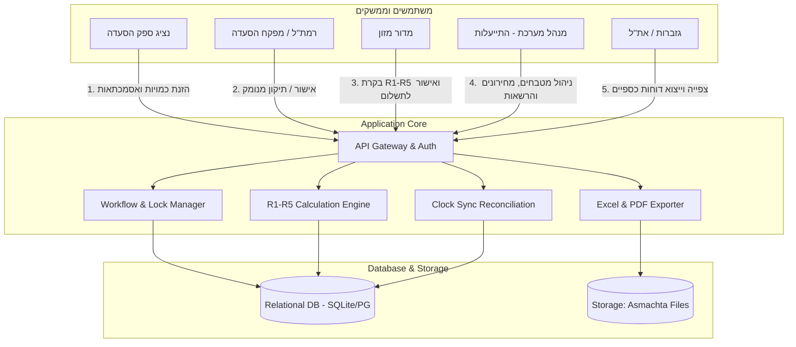
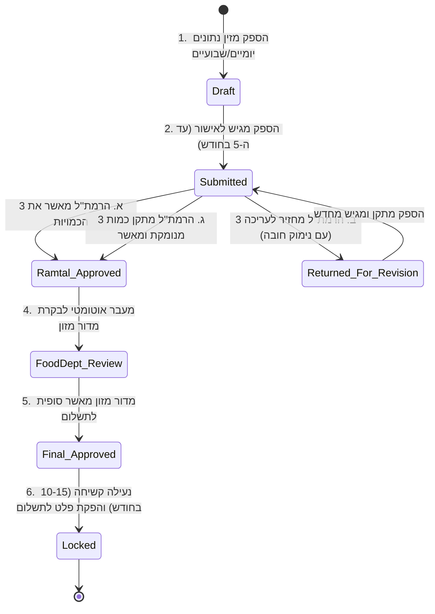

# מסמך אפיון מערכת סופי — שלב ב' (SPEC-B)
# מיכון ובקרת דיווח כמויות ארוחות מחוץ לשעון

| | |
|---|---|
| **מספר מסמך** | SPEC-B-2026-v1.0 |
| **תאריך הפקה** | 17/08/2026 |
| **סיווג ביטחוני** | **בלמ"ס** (בלתי מסווג) |
| **מקור הדרישה** | מכתב הנעת פרויקט — רפ"ק זאב נאורי, ר' חוליית התייעלות כלכלית 📄 |
| **גורם מקצועי מאשר** | אריק כרמי — נציג מדור מזון (את"ל) 📄 |
| **כותבי האפיון והארכיטקטורה** | ישי ואור — חוליית התייעלות כלכלית 📄 |
| **סטטוס** | מסמך אפיון מחייב לפיתוח ולמסירה |

---

## 1. תקציר מנהלים, רקע ומטרות

### 1.1 הרקע העסקי
משטרת ישראל משלמת לספקי ההסעדה השונים על בסיס 2 ערוצים עיקריים:
1. **ארוחות שנרשמו בשעון הנוכחות (העברת כרטיס מגנטי/שוטר):** נרשמות דיגיטלית במערכת השעונים.
2. **ארוחות מחוץ לשעון (הסעדה ידנית / משיכות / אירועים / חד"א):** באישור מדור מזון ובהסדר מול הספקים השונים.

בהתאם להנחיית ראש את"ל ופגישת סטאטוס כלכלה, מדור התייעלות כלכלית בשיתוף מדור מזון ממכנים ומאחדים את כלל תהליך הדיווח, האישור והבקרות של כמויות הארוחות מחוץ לשעון.

### 1.2 מטרות המערכת החדשה
- **אחידות ודיגיטציה:** מעבר מקבצי אקסל ידניים ומבוזרים של 3 ספקי הסעדה למערכת Web מרכזית ומאובטחת.
- **שקיפות ויומן שינויים (Audit Trail):** תיעוד מלא של כל שינוי כמות ע"י רמת"ל עם נימוק חובה ושמירת נתוני המקור של הספק.
- **אוטומציה של חוקי חישוב R1–R5:** ביטול טעויות אנוש בחישוב קיצוצי מכמש, תוספות כשרות צוחר, המרות אירועים והשלמות מינימום רבעוני.
- **מניעת תשלום כפול (הצלבת שעון):** מודול זיהוי חפיפות בין רישומי השעון לדיווחי הספק מחוץ לשעון.
- **הפקת פלט לתשלום:** יצירת קובץ אקסל תקני ודוח PDF חתום ישירות לגזברות ולחשבות את"ל.

---

## 2. מילון מונחים והגדרות יסוד

| מונח | הגדרה מחייבת |
|---|---|
| **מטבח** | אתר אספקת ארוחות משטרתי (למשל: מכמש, צוחר, חולות, מטה ארצי, בית שמש). כל מטבח משויך לספק יחיד (DR-05). |
| **ספק הסעדה** | חברה חיצונית המפעילה את שירותי ההסעדה (שופרסל, עידית, סודקסו). |
| **רמת"ל / מפקח הסעדה** | קצין/נגד משטרה האחראי על המרחב/המטבח ומאשר את כמויות הארוחות שסופקו בפועל בשטח. |
| **מדור מזון** | הגורם המקצועי באת"ל האחראי על מדיניות ההזנה, המחירונים, חוקי ההמרות והאישור הסופי לתשלום. |
| **חד"א פנימי** | ארוחות שנצרכו בתוך חדר האוכל הפיזי (רלוונטי לקיצוץ 10% במכמש). |
| **משיכות חוץ / קו** | ארוחות שנלקחו כחמגשיות/צידניות לפעילות מבצעית בשטח (אינן מקוצצות במכמש). |
| **תקופת דיווח (Period)** | חודש קלנדרי (למשל 08/2026). תאריך יעד להגשה: 5 בחודש; נעילה קשיחה: 10–15 בחודש. |

---

## 3. ארכיטקטורת המערכת ומודל הרשאות (RBAC)

### מטריצת תפקידים והרשאות

| פעולה במערכת | נציג ספק | רמת"ל | מדור מזון | מנהל מערכת | צופה גזברות |
|---|:---:|:---:|:---:|:---:|:---:|
| הזנת כמויות יומיות / חודשיות | ✅ | ❌ | ❌ | ❌ | ❌ |
| העלאת קבצי אסמכתא וחשבוניות | ✅ | ❌ | ❌ | ❌ | ❌ |
| הגשת דיווח חודשי לרמת"ל | ✅ | ❌ | ❌ | ❌ | ❌ |
| אישור כמות חודשית ברמת מרחב | ❌ | ✅ | ❌ | ❌ | ❌ |
| תיקון כמות נקודתית עם נימוק חובה | ❌ | ✅ | ✅ | ❌ | ❌ |
| החזרת חודש לעריכת הספק | ❌ | ✅ | ✅ | ❌ | ❌ |
| הפעלת מנוע R1-R5 ואישור סופי | ❌ | צפייה | ✅ | ✅ | צפייה |
| הפקת קבצי אקסל ו-PDF לתשלום | ❌ | ❌ | ✅ | ✅ | ✅ |
| ניהול מטבחים, מחירונים ומשתמשים | ❌ | ❌ | ❌ | ✅ | ❌ |

---

## 4. מכונת המצבים של מחזור הדיווח החודשי

---

## 5. צנרת חוקי החישוב וההמרות (R1–R5 Calculation Engine)

מנוע החישוב פועל בצורה מודולרית ומייצר שקיפות מלאה (Audit Trail) עבור כל חוק:

### 5.1 כלל R1 — קיצוץ מכמש (10%)
- **תנאי תחולה:** מטבח שבו `appliesR1Machmesh == true`.
- **היגיון חישוב:** קיצוץ 10% מופעל **אך ורק על כמות חד"א פנימי** (`dining_hall_qty`). כמות המשיכות מחוץ לחד"א (`takeaway_qty`) נשארת 100% ללא קיצוץ.
- **נוסחה:**
  $$\text{Net Meals} = (\text{dining\_hall\_qty} \times 0.90) + \text{takeaway\_qty}$$

### 5.2 כלל R2 — תוספת צוחר / חולות (30%)
- **תנאי תחולה:** מטבח שבו `appliesR2Tzohar == true`.
- **היגיון חישוב:** תוספת 30% על כמות הארוחות המאושרות בגין המרה לכשרות מהודרת.
- **נוסחה:**
  $$\text{Net Meals} = \text{Approved Qty} \times 1.30$$

### 5.3 כלל R3 — המרת אירועים וכיבודים
- **תנאי תחולה:** שורת דיווח מוגדרת כאירוע עם סכום חשבונית מאושר בש"ח (`eventCostNis > 0`).
- **היגיון חישוב:** המרת הסכום הכספי למנות אקוויוולנטיות לפי מחיר מנת ייחוס (ארוחת צהריים).
- **נוסחה:**
  $$\text{Converted Meals} = \text{Round}\left(\frac{\text{event\_cost\_nis}}{\text{base\_lunch\_price}}\right)$$

### 5.4 כלל R4 — ארוחת ערב חמה
- **היגיון חישוב:** המרת פער המחירים בין מחיר ארוחת ערב חמה למחיר ארוחת צהריים/ערב רגילה לכמות מנות אקוויוולנטית.

### 5.5 כלל R5 — השלמה למינימום רבעוני
- **תנאי תחולה:** מטבח עם חובת מינימום חוזי (`hasQuarterlyMinimum == true`) בחודש סגירת רבעון (חודשים 3, 6, 9, 12).
- **היגיון חישוב:** בדיקת סך הארוחות בפועל בשלושת חודשי הרבעון מול המינימום החוזי והשלמת הפער:
  $$\text{Deficit} = \max(0, \text{quarterly\_minimum} - \text{quarter\_actual\_meals})$$

### 5.6 כללי עיגול (Rounding Policy)
- כלל החישובים מעוגלים לפי **עיגול מתמטי תקני (Half-Up)** לשלם הקרוב, תוך תיעוד מלא של שברי המנות ביומן החישוב.

---

## 6. מחירוני המכרז הרשמיים, 11 האשכולות וסוגי הארוחות

> **מקור:** קובץ נתוני מדור מזון (`data/עותק של טבלת ניהול מחוץ לשעון- עותק.xlsx` שורות 152–176).

### 6.1 מחירון המכרז הבסיסי (ש"ח, לא כולל מע"מ) לפי 11 אשכולות

| סוג מנה / ארוחה | אשכול א' (צפון) | אשכול ב' (חוף) | אשכול ג' (מרכז) | אשכול ד' (ת"א) | אשכול ה' (מג"ב מרכז) | אשכול ו' (ש"י) | אשכול ז' (י-ם) | אשכול ח' (עוטף י-ם) | לכיש (דרום) | נגב (דרום) | מכמש (גורמה) |
|---|:---:|:---:|:---:|:---:|:---:|:---:|:---:|:---:|:---:|:---:|:---:|
| **ארוחת בוקר (א'-ו')** | 20.00 | 19.00 | 20.00 | 25.00 | 35.84 | 31.36 | 19.00 | 25.00 | 48.16 | 43.68 | 13.85 |
| **ארוחת צהריים (א'-ו')** | 40.60 | 35.60 | 38.60 | 47.60 | 48.72 | 47.48 | 34.37 | 44.60 | 56.00 | 45.92 | 25.25 |
| **ארוחת ערב (א'-ה')** | 20.00 | 19.00 | 20.00 | 25.00 | 38.08 | 33.60 | 19.00 | 25.00 | 50.40 | 43.68 | 13.90 |
| **ערב שישי בשרית (פיקס)** | 44.00 | 39.00 | 42.00 | 53.00 | 48.16 | 48.16 | 37.77 | 50.00 | 64.96 | 64.96 | 32.00 |
| **שבת צהריים (פיקס)** | 44.00 | 39.00 | 42.00 | 48.00 | 44.80 | 44.80 | 34.77 | 45.00 | 61.60 | 61.60 | 30.00 |
| **שבת בוקר (פיקס)** | 20.00 | 19.00 | 20.00 | 25.00 | 38.00 | 40.32 | 19.00 | 25.00 | 59.36 | 59.36 | 30.00 |
| **מוצאי שבת (פיקס)** | 20.00 | 19.00 | 20.00 | 25.00 | 42.56 | 41.44 | 19.00 | 25.00 | 59.36 | 59.36 | 13.90 |

### 6.2 תעריפי קבע ארציים (ש"ח, לכלל האשכולות)

| פריט / שירות נלווה | תעריף אחיד בש"ח | הערות יישום ומדיניות |
|---|:---:|---|
| **בולים (בולי מזון)** | **37.77 ₪** | שובר הזנה מחוץ לשעון לשוטרים בפעילות שטח / שבת |
| **שינוע חם** | **8.31 ₪** | תוספת הובלה תרמית מבוקרת למנה חמה |
| **שינוע קר** | **14.83 ₪** | תוספת הובלה בקירור למארזים וצידניות |
| **תוספת חלבון** | **6.00 ₪** | תוספת מנת חלבון ייעודית (טונה / ביצים / גבינה) |
| **חמגשית (3 תאים)** | **20.00 ₪** | אריזה אישית 3 תאים |
| **נלווה לחמגשית** | **12.00 ₪** | סכו"ם, רטבים, לחמניה ושתייה |
| **ארוחת ביניים ולילה** | **5.00 ₪** | כריך / כיבוד קל למשמרות לילה |
| **חמגשית עצור** | **25.00 ₪** | מנה ייעודית לתאי מעצר ותחנות |
| **מארז בוקר** | **17.00 ₪** | מארז הזנה אישי אטום לבוקר |
| **מארז בשרי / פרווה** | **25.00 ₪** | מארז הזנה מבצעי אטום לצהריים/ערב |
| **ערכות סימני חג** | **80.00 ₪** | ערכה מיוחדת לראש השנה ופסח |

---

## 7. פריסת 125 התחנות והיחידות לפי 4 הספקים והאשכולות

| ספק | אשכולות משויכים | מספר תחנות | תחנות ובסיסים עיקריים |
|---|---|:---:|---|
| **גורמה** | מכמש | 3 | בסיס מכמש, קציעות + צוחר (חולות), מתקן כליאה עופר (חרדים). |
| **מבושלת** | אשכולות א', ב', ג', ד', ז', ח', ט' | 80 | **צפון (א'):** מטה צפון, כרמיאל, נצרת, עפולה, צפת, טבריה, ק"ש, מג"ב כח. **חוף (ב'):** מחוז חוף, חיפה, זבולון, עכו, נהריה, חדרה, עירון, אום אל פחם. **מרכז (ג'):** נתניה, כפ"ס, טייבה, טירה, פ"ת, ראש העין, אריאל, מודיעין. **ת"א (ד'):** בית השוטר ת"א, ירקון, לב ת"א, מסובים, גלילות, בת ים, חולון. **ירושלים (ז'):** בה"ד מג"ב, מגרש הרוסים, עטרות, מחכמה, יהודאי, ימ"ס כנפש, מרחב דוד, בית השוטר ים. **עוטף י-ם (ח'):** מג"ב הר גילה, מצודת אדומים, אבודיס, ענאתא, מחסום 300, קלנדיה. **מטה (ט'):** מטא"ר, מרלוג בית שמש. |
| **ליבר** | אשכולות ה', ו', לכיש, נגב | 40 | **מג"ב מרכז (ה'):** מג"ב אייל, מג"ב שרון, מעברים, בסכ"מ נעורים. **ש"י (ו'):** מחוז ש"י, בנימין, שומרון, עציון, מעלה אדומים, חריש. **לכיש (א'):** אשדוד, אשקלון, קרית גת, קרית מלאכי, שדרות, נתיבות, אופקים, יד מרדכי, בית גוברין. **נגב (ב'):** באר שבע, רהט, ערוער, דימונה, ערד, עיירות, ימ"ר נגב, יואב. |
| **סודקסו** | מרחב אילת | 2 | תחנת אילת, מג"ב מרחב אילת. |

---

## 8. אילוצי מסד נתונים מחייבים (DR-01..DR-05)

1. **DR-01 (מפתח זהות נפרד משם):** רשומות דיווח מצביעות על מזהה המטבח (`kitchen_id`), לעולם לא על מחרוזת שמו. שינוי שם אינו משכתב חודשי עבר סגורים.
2. **DR-02 (אין מחיקת מטבחים):** השבתת מטבח נעשית באמצעות דגל פעילות `is_active = false`. אין פקודת Delete במסד.
3. **DR-03 (תאריך תחילת פעילות):** מטבח חדש נפתח עם תאריך תחולה ואינו מופיע בחודשים שקדמו לפתיחתו.
4. **DR-04 (השבתה עתידית בסוף חודש):** השבתת מטבח נושאת תאריך תחולה של תחילת החודש הבא, כדי שהחודש הפעיל ימשיך וישולם במלואו.
5. **DR-05 (ספק יחיד למטבח):** כל מטבח שייך לספק אחד בלבד. הרשאת הספק נגזרת ישירות משיוך המטבח.

---

## 9. מודול הצלבת שעון נוכחות (Anti-Duplicate Clock Sync)

- **מטרה:** מניעת תשלום כפול על ארוחה שבה השוטר גם העביר כרטיס בשעון וגם דווחה מחוץ לשעון ע"י הספק.
- **מנגנון הפעולה:**
  1. טעינת קובץ נתוני שעון (Excel/CSV) תקופתי.
  2. הצלבה לפי: תאריך + סוג ארוחה + אתר/מטבח.
  3. הפקת דוח התראות וחריגות חודשי עם פוטנציאל חיסכון כספי למדור התייעלות.
